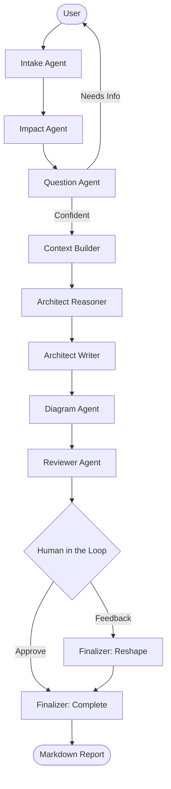

# Architecture Assessment Agent

A multi-agent LangGraph system to automatically generate **Pareceres de Arquitetura** based on user requests, portfolio impact analysis, and architectural reasoning.

## Overview
This system utilizes 9 specialized agents to ingest an architectural request, cross-reference it with the application portfolio, generate clarifying questions, and output a detailed Portuguese Architecture Assessment in Markdown.



## Setup
1. `pip install -r requirements.txt`
2. Copy `.env.example` to `.env` and add your API keys (e.g., `GOOGLE_API_KEY`).
3. Ensure the Application Portfolio is up-to-date in `data/application_portfolio.json`.

## Usage
Run the Typer CLI:
```bash
python main.py
```

Provide input via a text file:
```bash
python main.py --file input.txt
```

Resume the previous session:
```bash
python main.py --resume
```
